# TenantFlow AI — Project Documentation

## Table of Contents
1. [Project Overview](#1-project-overview)
2. [Approach & Methodology](#2-approach--methodology)
3. [Technology Stack](#3-technology-stack)
4. [System Architecture](#4-system-architecture)
5. [Backend Architecture](#5-backend-architecture)
6. [Frontend Architecture](#6-frontend-architecture)
7. [Smart Agent — Dynamic Backend Generation](#7-smart-agent--dynamic-backend-generation)
8. [Authentication & Authorization Flow](#8-authentication--authorization-flow)
9. [AI Website Generation Flow](#9-ai-website-generation-flow)
10. [Database Schema](#10-database-schema)
11. [API Reference](#11-api-reference)
12. [Deployment & Setup](#12-deployment--setup)

---

## 1. Project Overview

**TenantFlow AI** is a multi-tenant, AI-powered website builder platform. Users describe a website in natural language, and the platform generates a fully styled, responsive HTML website in real-time using LLM streaming. Each generated website also receives an auto-generated dynamic backend API through a smart agent flow.

### Key Capabilities
- 🤖 AI-powered website generation via Groq (LLaMA 3.3 70B)
- 🔄 Real-time SSE streaming with live preview
- 🔧 Smart agent that auto-generates REST APIs for each website
- 🏢 Multi-tenant architecture with plan-based limits
- 🔐 JWT authentication with Role-Based Access Control (RBAC)
- 📊 Dashboard with analytics, billing, team management, and deployment tracking

---

## 2. Approach & Methodology

### 2.1 Migration Strategy
The project was migrated from a **Next.js monolithic** architecture to a **decoupled MERN stack**:

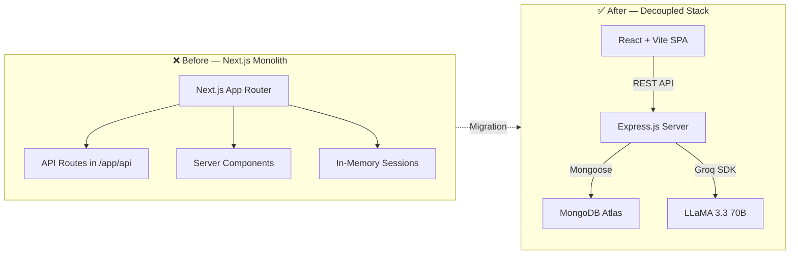

### 2.2 Development Phases

| Phase | Activities | Output |
|-------|-----------|--------|
| **Planning** | Analyzed Next.js codebase, identified 8 models, 9 route groups, 13 pages | Implementation plan with file-by-file breakdown |
| **Backend Foundation** | Set up Express server, MongoDB connection, Mongoose models, JWT auth | 17 backend files (models, routes, middleware, services) |
| **Frontend Build** | Created React SPA with Vite, design system, routing, auth context | 16 frontend files (pages, components, context, API client) |
| **AI Integration** | Implemented Groq-powered streaming generation with SSE | Real-time website builder with chat interface |
| **Smart Agent** | Built agent flow that analyzes HTML → generates backend schemas | Dynamic per-website REST API endpoints |
| **Verification** | End-to-end testing of login, API routes, streaming, proxy | All systems operational |

### 2.3 Design Principles
1. **Separation of Concerns** — Frontend (port 3000) and backend (port 5000) are fully decoupled
2. **Tenant Isolation** — All data is scoped per tenant via `req.tenantId` middleware injection
3. **Streaming-First AI** — SSE for real-time generation instead of batch responses
4. **Defense in Depth** — JWT verification → tenant lookup → RBAC permission check on every request
5. **Graceful Degradation** — Retry logic (2 retries with exponential backoff) on AI rate limits

---

## 3. Technology Stack

### 3.1 Stack Overview

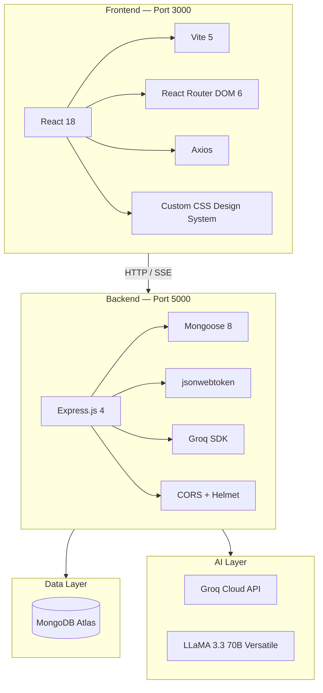

### 3.2 Detailed Stack Table

| Layer | Technology | Version | Purpose |
|-------|-----------|---------|---------|
| **Frontend Runtime** | React | 18.x | Component-based UI |
| **Build Tool** | Vite | 5.4 | Fast HMR, ES module bundling |
| **Routing** | React Router DOM | 6.x | Client-side SPA routing |
| **HTTP Client** | Axios | 1.x | API calls with JWT interceptors |
| **Styling** | Vanilla CSS | — | Custom dark-theme design system with glassmorphism |
| **Backend Runtime** | Node.js | 24.x | Server-side JavaScript |
| **Web Framework** | Express.js | 4.x | REST API, middleware pipeline |
| **ODM** | Mongoose | 8.x | MongoDB object modeling |
| **Database** | MongoDB Atlas | 7.x | Cloud-hosted NoSQL database |
| **Auth** | jsonwebtoken | 9.x | JWT token signing and verification |
| **Password Hashing** | bcryptjs | 2.x | Secure password storage |
| **AI SDK** | groq-sdk | latest | LLM API for website generation |
| **AI Model** | LLaMA 3.3 70B | Versatile | Fast, high-quality code generation |
| **Security** | helmet, cors | latest | HTTP headers, cross-origin protection |

---

## 4. System Architecture

### 4.1 High-Level Architecture

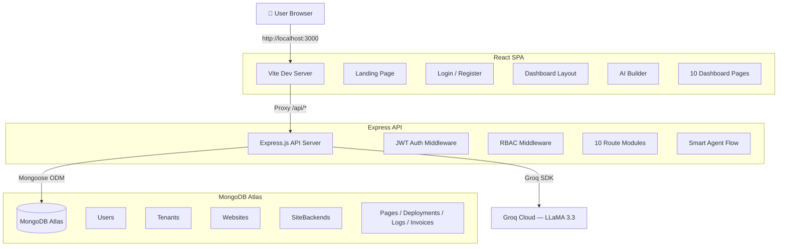

### 4.2 Request Flow

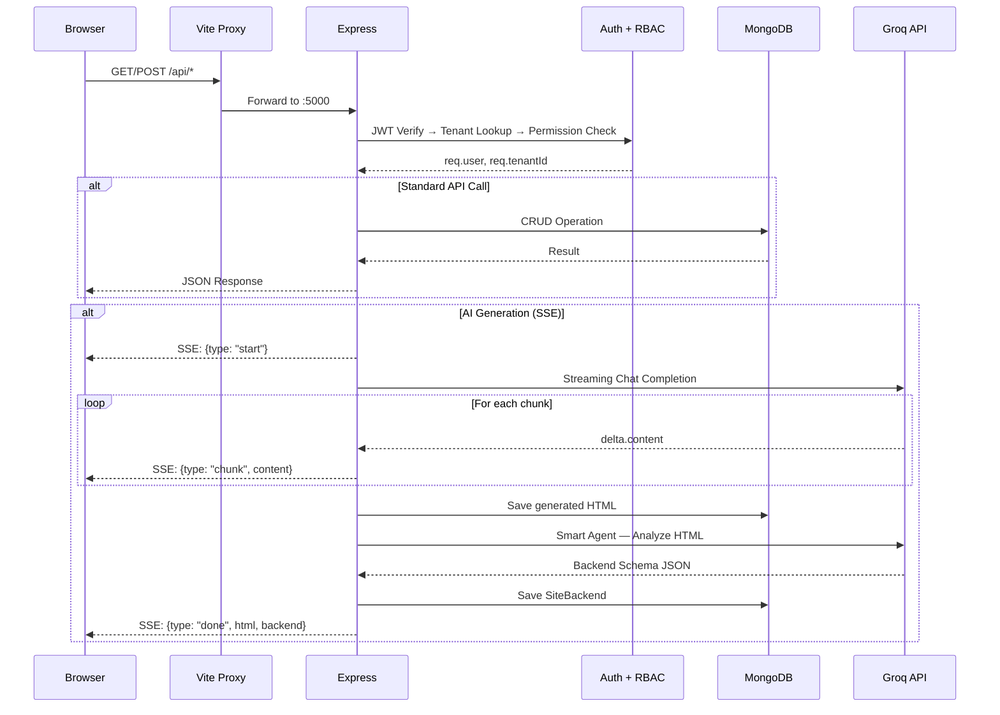

---

## 5. Backend Architecture

### 5.1 Directory Structure

```
server/
├── index.js                 # Express app, middleware, route mounting
├── config/
│   └── db.js                # MongoDB Atlas connection
├── middleware/
│   ├── auth.js              # JWT verification, tenant injection
│   └── rbac.js              # Role-Based Access Control (20 permissions)
├── models/
│   ├── User.js              # User model (name, email, password, role, tenant)
│   ├── Tenant.js            # Tenant model (plan, limits, usage, branding)
│   ├── Website.js           # Website model (HTML, domain, status)
│   ├── Page.js              # Page model (content, versioning)
│   ├── SiteBackend.js       # Per-website backend (apiDefinition, data)
│   ├── Deployment.js        # Deployment history model
│   ├── ActivityLog.js       # Activity audit log
│   └── Invoice.js           # Billing invoice model
├── routes/
│   ├── auth.js              # POST /login, /register, /logout, GET /me
│   ├── tenants.js           # GET/PUT tenant settings
│   ├── websites.js          # CRUD websites
│   ├── pages.js             # CRUD pages with versioning
│   ├── ai.js                # POST /generate (SSE streaming)
│   ├── siteBackends.js      # Dynamic backend management + public API
│   ├── deploy.js            # Deployment management
│   ├── billing.js           # Plans, invoices, payment history
│   ├── team.js              # Team member management, invitations
│   └── analytics.js         # Traffic, top pages, referrers, activity
├── services/
│   ├── gemini.js            # Groq LLM streaming service
│   └── agentFlow.js         # Smart agent — HTML → backend schema
└── seed.js                  # Database seeding script
```

### 5.2 Middleware Pipeline

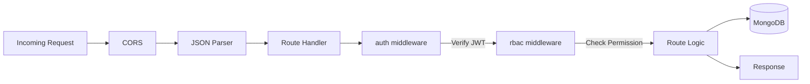

### 5.3 RBAC Permission Matrix

| Role | Users | Websites | Pages | AI | Deploy | Billing | Team | Analytics |
|------|-------|----------|-------|----|--------|---------|------|-----------|
| **Owner** | ✅ All | ✅ All | ✅ All | ✅ | ✅ | ✅ All | ✅ All | ✅ |
| **Admin** | ✅ Read | ✅ All | ✅ All | ✅ | ✅ | ✅ Read | ✅ All | ✅ |
| **Editor** | ❌ | ✅ R/W | ✅ All | ✅ | ❌ | ❌ | ❌ | ✅ |
| **Developer** | ❌ | ✅ R/W | ✅ All | ✅ | ✅ | ❌ | ❌ | ✅ |
| **Viewer** | ❌ | ✅ Read | ✅ Read | ❌ | ❌ | ❌ | ❌ | ✅ |

---

## 6. Frontend Architecture

### 6.1 Component Tree

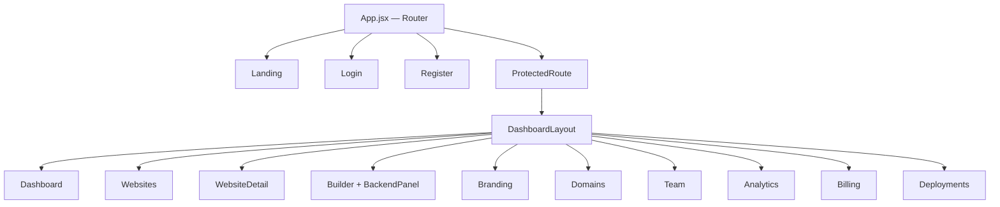

### 6.2 State Management

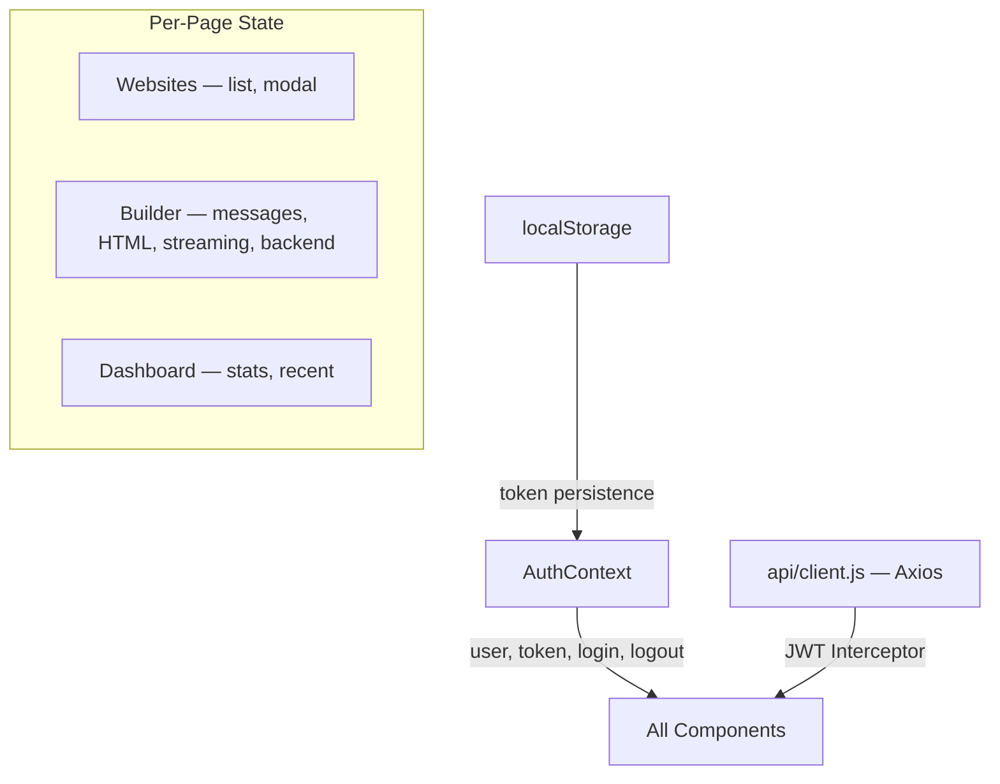

### 6.3 Page Inventory

| Page | Route | Key Features |
|------|-------|-------------|
| Landing | `/` | Hero, features grid, CTA, pricing preview |
| Login | `/login` | Email/password form, error handling, redirect |
| Register | `/register` | Name, email, password, organization |
| Dashboard | `/dashboard` | Stats cards, quick actions, recent websites, plan usage |
| Websites | `/dashboard/websites` | Website grid, create modal, status badges |
| Website Detail | `/dashboard/websites/:id` | Info card, iframe preview, action buttons |
| **AI Builder** | `/dashboard/websites/:id/builder` | Chat, streaming, preview, code, **backend panel** |
| Branding | `/dashboard/branding` | Color picker, font selector, live preview |
| Domains | `/dashboard/domains` | Domain management table, DNS setup guide |
| Team | `/dashboard/team` | Member list, invite modal, role management |
| Analytics | `/dashboard/analytics` | Traffic stats, top pages, referrers, activity log |
| Billing | `/dashboard/billing` | Plan cards, switch plan, payment history |
| Deployments | `/dashboard/deployments` | Deployment history table with status badges |

---

## 7. Smart Agent — Dynamic Backend Generation

### 7.1 Overview
Each AI-generated website automatically receives its own REST API through a two-phase agent flow:

### 7.2 Agent Flow Diagram

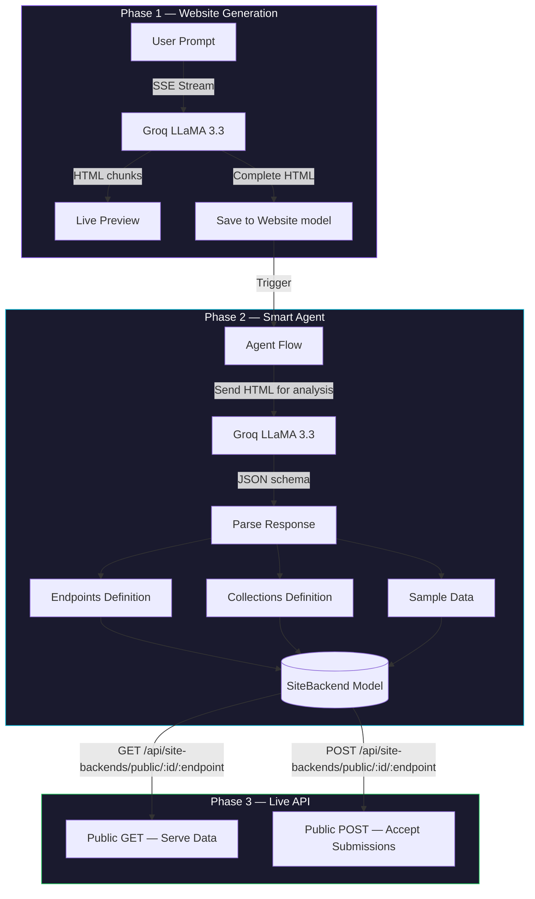

### 7.3 Example: Restaurant Website → Auto-Generated API

When a user generates a restaurant website, the smart agent produces:

| Method | Endpoint | Auto-Generated Data |
|--------|----------|-------------------|
| `GET` | `/menu` | 3 sample menu items (name, price, category) |
| `POST` | `/reservations` | Accepts: name, email, phone, date, time, guests |
| `POST` | `/contact` | Accepts: name, email, message |
| `GET` | `/testimonials` | 2 sample reviews with ratings |
| `GET` | `/site-info` | Website title, description, metadata |

### 7.4 Agent Schema Format
```json
{
  "endpoints": [
    {
      "method": "GET",
      "path": "/menu",
      "description": "Returns restaurant menu items",
      "handler": "getMenu",
      "fields": ["name", "description", "price", "category"],
      "sampleData": [{"name": "Margherita", "price": 14.99, "category": "Pizza"}]
    }
  ],
  "collections": [
    {
      "name": "menu",
      "schema": {"name": "string", "price": "number", "category": "string"}
    }
  ]
}
```

---

## 8. Authentication & Authorization Flow

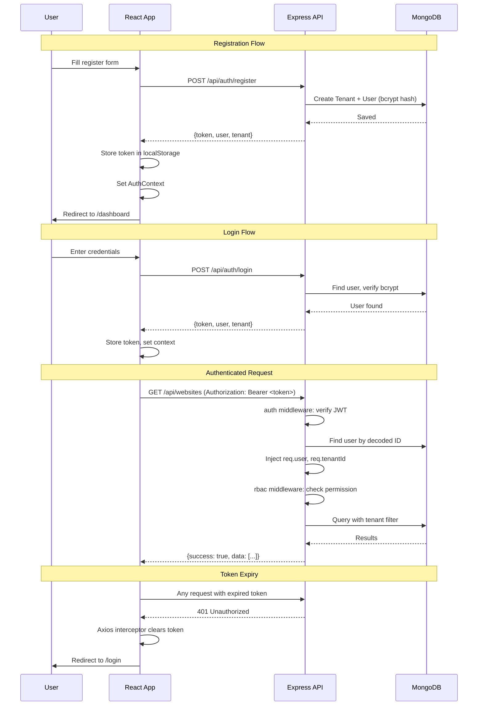

---

## 9. AI Website Generation Flow

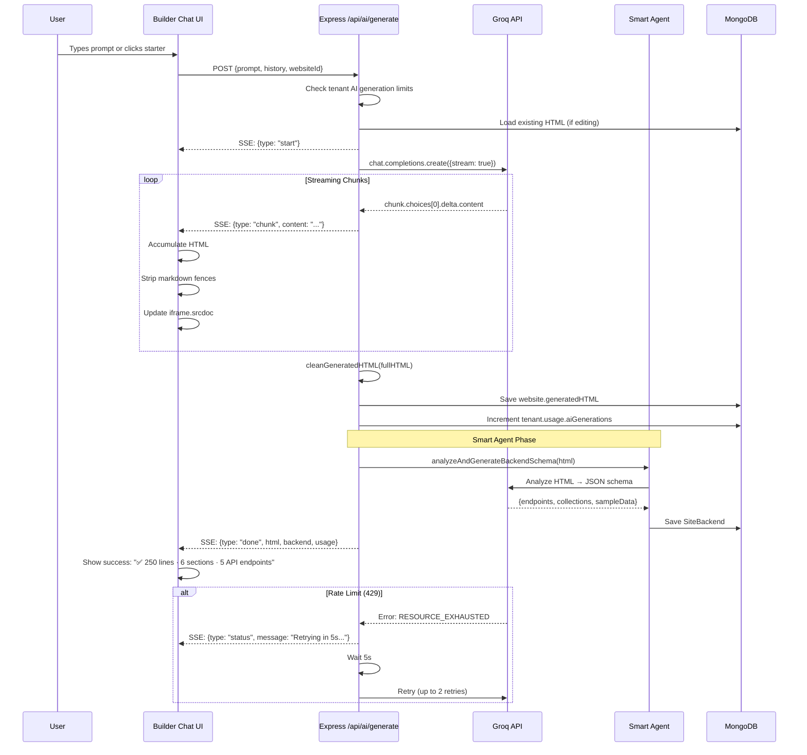

---

## 10. Database Schema

### 10.1 Entity Relationship Diagram

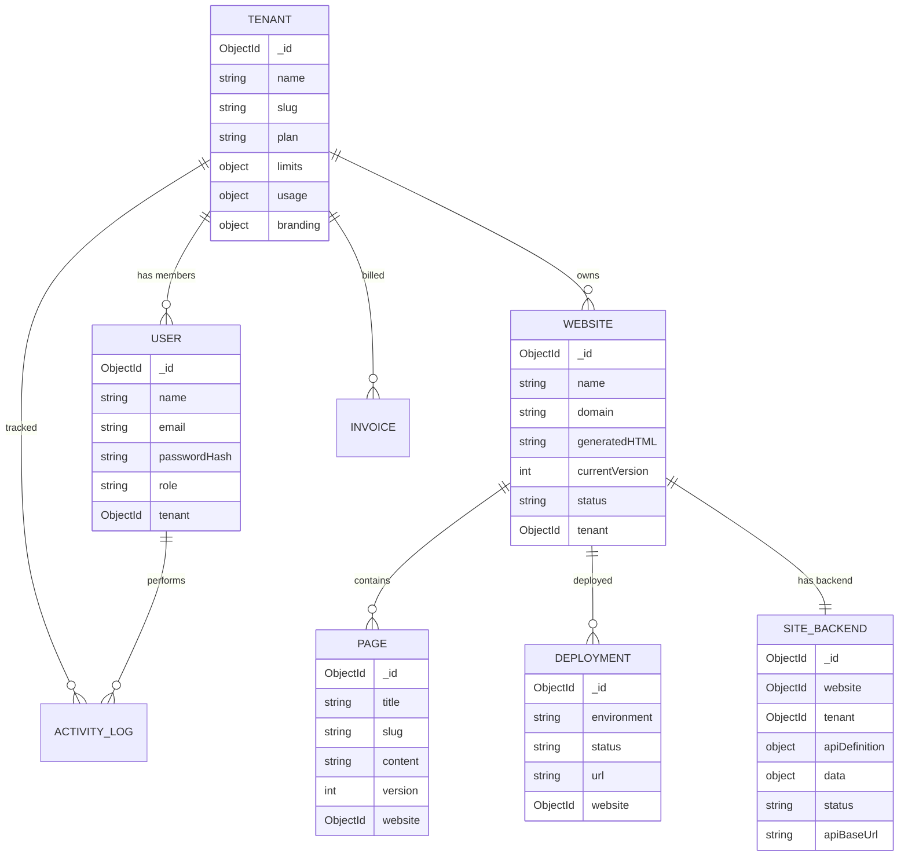

### 10.2 Model Summary Table

| Model | Key Fields | Relationships |
|-------|-----------|---------------|
| **Tenant** | name, slug, plan, limits (websites, pages, AI gens, storage), usage counters, branding (colors, fonts) | Has many Users, Websites, Invoices |
| **User** | name, email, passwordHash (bcrypt), role (owner/admin/editor/developer/viewer) | Belongs to Tenant |
| **Website** | name, domain, generatedHTML, currentVersion, status, businessType | Belongs to Tenant, has Pages, Deployments, SiteBackend |
| **SiteBackend** | apiDefinition (endpoints + collections), data (dynamic key-value store), status, apiBaseUrl | Belongs to Website + Tenant |
| **Page** | title, slug, content, version, previousVersions[] | Belongs to Website |
| **Deployment** | environment, status, url, buildTime, commitMessage | Belongs to Website |
| **ActivityLog** | user info, action, entityType, entityId, details, ipAddress | Belongs to Tenant |
| **Invoice** | amount, currency, status, plan, periodStart/End | Belongs to Tenant |

---

## 11. API Reference

### 11.1 Authentication
| Method | Endpoint | Auth | Description |
|--------|----------|------|-------------|
| `POST` | `/api/auth/register` | — | Create tenant + user account |
| `POST` | `/api/auth/login` | — | Authenticate, returns JWT |
| `POST` | `/api/auth/logout` | JWT | Invalidate session |
| `GET` | `/api/auth/me` | JWT | Get current user + tenant |

### 11.2 Websites
| Method | Endpoint | Auth | Description |
|--------|----------|------|-------------|
| `GET` | `/api/websites` | JWT | List tenant's websites |
| `POST` | `/api/websites` | JWT + `websites.create` | Create website |
| `GET` | `/api/websites/:id` | JWT | Get website detail |
| `PUT` | `/api/websites/:id` | JWT + `websites.update` | Update website |
| `DELETE` | `/api/websites/:id` | JWT + `websites.delete` | Delete website |

### 11.3 AI Generation
| Method | Endpoint | Auth | Description |
|--------|----------|------|-------------|
| `POST` | `/api/ai/generate` | JWT + `ai.generate` | SSE stream: generate/modify website via Groq |

### 11.4 Dynamic Site Backends
| Method | Endpoint | Auth | Description |
|--------|----------|------|-------------|
| `GET` | `/api/site-backends/:websiteId` | JWT | Get backend config |
| `POST` | `/api/site-backends/:websiteId/generate` | JWT | Trigger smart agent |
| `PUT` | `/api/site-backends/:websiteId/data/:collection` | JWT | Update collection data |
| `GET` | `/api/site-backends/public/:websiteId/:endpoint` | — | Public GET data |
| `POST` | `/api/site-backends/public/:websiteId/:endpoint` | — | Public form submission |

### 11.5 Other Routes
| Group | Endpoints | Description |
|-------|-----------|-------------|
| **Tenants** | `GET/PUT /api/tenants/current` | Read/update tenant settings |
| **Pages** | `CRUD /api/pages` | Page management with versioning |
| **Deploy** | `POST/GET /api/deploy` | Trigger and list deployments |
| **Billing** | `GET/POST /api/billing` | Plans, invoices, payment history |
| **Team** | `GET/POST/DELETE /api/team` | Invite, list, remove members |
| **Analytics** | `GET /api/analytics` | Traffic, pages, referrers, logs |

---

## 12. Deployment & Setup

### 12.1 Environment Variables
```env
MONGODB_URI=mongodb+srv://...          # MongoDB Atlas connection string
GROQ_API_KEY=gsk_...                   # Groq API key for LLaMA
JWT_SECRET=your_jwt_secret             # JWT signing secret
PORT=5000                              # Express server port
```

### 12.2 Quick Start
```bash
# Install dependencies
npm install

# Seed database with demo data
node server/seed.js

# Start both servers (frontend + backend)
npm run dev

# Access
# Frontend: http://localhost:3000
# Backend:  http://localhost:5000

# Demo login
# Email:    marco@bellacucina.com
# Password: demo123
```

### 12.3 Demo Accounts (from seed)

| Email | Password | Tenant | Plan |
|-------|----------|--------|------|
| `marco@bellacucina.com` | `demo123` | Bella Cucina | Free |
| `sarah@designpixel.io` | `demo123` | Design Pixel | Starter |
| `james@greenleaf.com` | `demo123` | GreenLeaf Organics | Professional |

---

*Document generated: February 21, 2026*
*Platform: TenantFlow AI v1.0*
