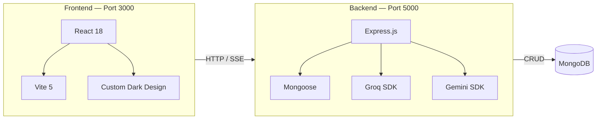

# 🚀 TenantFlow AI — Multi-Tenant AI Website Builder

**TenantFlow AI** is a powerful multi-tenant platform that uses AI to build and deploy fully styled websites instantly. Users describe their ideas in natural language, and the platform generates responsive designs in real-time. Every unique generated site is augmented by an auto-structured dynamic backend API through smart agent flow frameworks.

---

## 🌟 Key Features

- **🤖 AI Multi-Website Builder**: Direct real-time site layout and structure generation using LLM streaming.
- **🔄 Smart Agent APIs**: Auto-scans generated pages to design matching backend collection REST APIs effortlessly.
- **🏢 Multi-Tenant Foundation**: Complete Dashboard structure with strict isolation per organization tenant level.
- **🔐 Enterprise Grade Security**: JWT & strict Role-Based Access controls across 20 granular levels.
- **📊 Operations Dashboard**: Standard analytics, user access auditing logs, and automatic plan accounting.

---

## 🛠️ Technology Stack

| Layer | Frontend (Port 3000) | Backend (Port 5000) |
| :--- | :--- | :--- |
| **Framework / Runtime** | React 18 (Vite 5) | Node.js (Express) |
| **Logic Layer** | React Router DOM | Mongoose 8 (MongoDB Atlas) |
| **AI LLM Framework** | SSE Streaming Streams | Groq & Google Gemini SDKs |
| **Design / Formats** | Glassmorphic Dark Vanilla CSS | CORS, Helmet Security Framework |

---

## 📋 Standard Architecture Flow

Below describes the Request Pipeline stream inside the MERN stack context:



---

## ⚙️ Quick Installation

### 1️⃣ Clone the Repository
```bash
git clone https://github.com/SWAYAMPATEL30/site-pilot.git
cd site-pilot
```

### 2️⃣ Install Dependencies
```bash
npm install
```

### 3️⃣ Configure EnvironmentVariables
Create a `.env` file in the root directory (matching `.env.example` file setup):

```env
MONGODB_URI=your_mongodb_connection_string
GROQ_API_KEY=your_groq_api_key
GEMINI_API_KEY=your_gemini_api_key
JWT_SECRET=your_jwt_signing_secret
PORT=5000
```

### 4️⃣ Seed Database (Optional)
```bash
npm run seed
```

### 5️⃣ Run Locally
Starts both front and back-ends concurrently.
```bash
npm run dev
```

- **Frontend**: [http://localhost:3000](http://localhost:3000)
- **Backend API**: [http://localhost:5000](http://localhost:5000)

---

## 🛳️ Production Deployment

### Option A: Unified Single-Server (Easy)
Builds React frontend into a static bundle and runs Express to serve it.
```bash
# 1. Build Client Bundle
npm run build

# 2. Set Node Environment to Production
export NODE_ENV=production  # (Set Env on Render/Heroku dashboard directly)

# 3. Start Unified Server
npm start
```

### Option B: Separate Hosting 
- **Frontend**: Deploy `dist/` bundle on **Vercel** or **Netlify**. Set environment setup variables if applicable.
- **Backend**: Deploy on **Render** or **Heroku**. Enable CORS policy restrictions mapping appropriately.

---

## 🛡️ License
Distributed under standard proprietary ownership rights. Created for high-scale, isolated multi-tenant deployment support.
