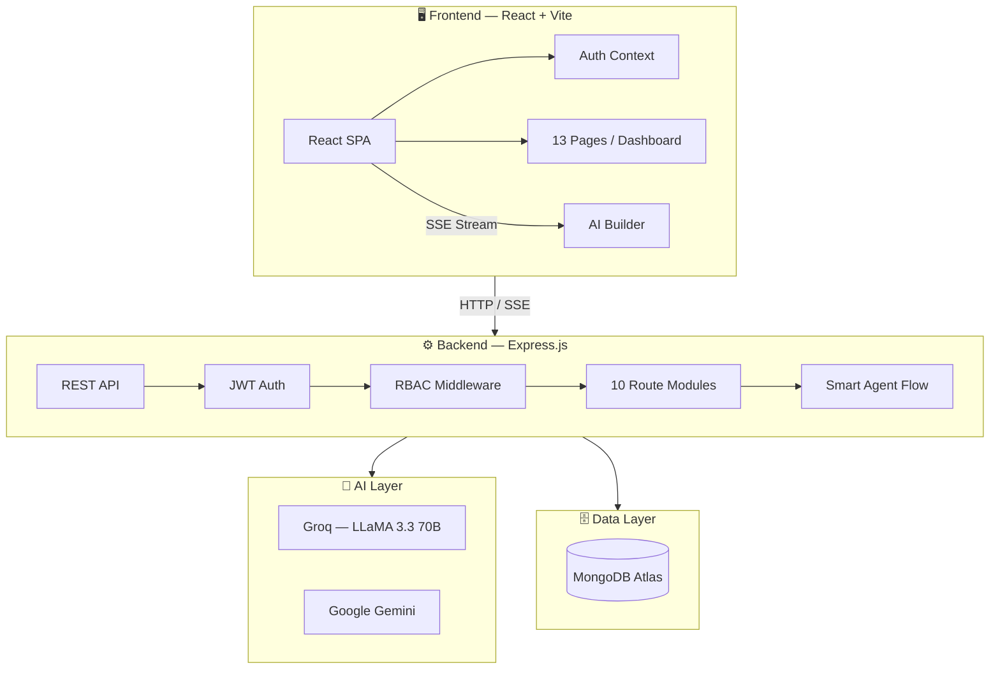

<div align="center">


<p align="center">
  <strong>Multi-Tenant AI-Powered Website Builder — Generate, Deploy & Manage Websites in Seconds.</strong>
</p>

<p align="center">
  <a href="https://site-pilot.onrender.com/" target="_blank">
    
  </a>
  &nbsp;
  <a href="https://github.com/SWAYAMPATEL30/site-pilot">
    
  </a>
</p>

<p align="center">
  
  
  
  
  
  
</p>

---

</div>

## 🌐 Live Demo

> **Try it now → [https://site-pilot.onrender.com/](https://site-pilot.onrender.com/)**

| Role | Email | Password |
|:-----|:------|:---------|
| 👑 Owner (Professional) | `marco@bellacucina.com` | `demo123` |
| 🧑‍💼 Owner (Starter) | `sarah@techstart.com` | `demo123` |
| 🌿 Owner (Free) | `james@greenleaf.com` | `demo123` |

Or just click **Register** to create your own free account instantly.

---

## ✨ What is Site Pilot?

**Site Pilot** is a full-stack, multi-tenant AI website builder. Describe any website in plain English — a restaurant, a portfolio, a SaaS landing page — and Site Pilot generates a complete, styled, responsive HTML website in real-time using LLM streaming. Every site also gets an **auto-generated backend API** via a smart agent flow.

---

## 🚀 Key Features

| Feature | Description |
|:--------|:------------|
| 🤖 **AI Website Generation** | Real-time streaming via Groq LLaMA 3.3 70B — watch your site build live |
| 🔧 **Smart Agent Backend** | Auto-generates REST API endpoints for every website (menus, forms, data) |
| 🏢 **Multi-Tenant Architecture** | Fully isolated orgs — each tenant gets their own data, limits & branding |
| 🔐 **JWT + RBAC Auth** | 5 roles × 20 granular permissions — Owner, Admin, Editor, Developer, Viewer |
| 📊 **Analytics Dashboard** | Traffic stats, top pages, referrers & activity audit log |
| 💳 **Billing & Plans** | Free → Starter → Professional → Enterprise plan management |
| 👥 **Team Collaboration** | Invite members, assign roles, manage access |
| 🌐 **Domain Management** | Custom domain setup with DNS guide |
| 📦 **One-Click Deploy** | Push live with deployment history tracking |

---

## 🛠️ Tech Stack

```
┌─────────────────────────────────────────────────────────┐
│                    SITE PILOT STACK                     │
├──────────────────────┬──────────────────────────────────┤
│  Frontend            │  Backend                         │
│  ─────────────────── │  ──────────────────────────────  │
│  React 18 + Vite 5   │  Node.js 22 + Express 4         │
│  React Router DOM 6  │  Mongoose 8 + MongoDB Atlas      │
│  Axios + SSE Stream  │  Groq SDK (LLaMA 3.3 70B)       │
│  Vanilla CSS (Dark)  │  Google Gemini SDK               │
│  Glassmorphism UI    │  JWT + bcryptjs                  │
│                      │  CORS + Helmet                   │
└──────────────────────┴──────────────────────────────────┘
```

---

## 🏗️ Architecture



---

## ⚡ Quick Start (Local)

### 1. Clone
```bash
git clone https://github.com/SWAYAMPATEL30/site-pilot.git
cd site-pilot
```

### 2. Install
```bash
npm install
```

### 3. Configure Environment
Create a `.env` file in the root (copy from `.env.example`):
```env
MONGODB_URI=your_mongodb_atlas_connection_string
GROQ_API_KEY=your_groq_api_key
GEMINI_API_KEY=your_google_gemini_api_key
JWT_SECRET=any_secure_random_string
PORT=5000
```

### 4. Seed Demo Data *(optional)*
```bash
npm run seed
```

### 5. Run
```bash
npm run dev
```
- 🖥️ Frontend → [http://localhost:3000](http://localhost:3000)  
- ⚙️ Backend API → [http://localhost:5000](http://localhost:5000)

---

## 🚢 Production Deployment (Render)

This project is configured for **single-server unified deployment** on Render.

| Setting | Value |
|:--------|:------|
| **Platform** | [Render.com](https://render.com) → Web Service |
| **Build Command** | `npm install --include=dev && npm run build` |
| **Start Command** | `npm start` |
| **Node Version** | `22.x` |

**Environment variables to set on Render:**

| Key | Value |
|:----|:------|
| `NODE_ENV` | `production` |
| `MONGODB_URI` | Your Atlas URI |
| `GROQ_API_KEY` | Your Groq key |
| `GEMINI_API_KEY` | Your Gemini key |
| `JWT_SECRET` | Secure random string |

> When `NODE_ENV=production`, Express automatically serves the built React frontend from `dist/`.

---

## 📁 Project Structure

```
site-pilot/
├── src/                    # React Frontend
│   ├── pages/              # 13 pages (Landing, Dashboard, Builder, etc.)
│   ├── components/         # Shared UI components
│   ├── contexts/           # AuthContext
│   ├── services/           # API client layer (api.js, http.js)
│   └── lib/                # Utilities, RBAC, store
├── server/                 # Express Backend
│   ├── routes/             # 10 route modules
│   ├── models/             # 8 Mongoose models
│   ├── middleware/         # JWT auth + RBAC
│   ├── services/           # Groq streaming + Smart Agent
│   └── config/             # MongoDB connection
├── index.html              # App entry point
├── vite.config.js          # Vite config with API proxy
└── package.json            # Unified scripts
```

---

## 🔑 API Reference

<details>
<summary><strong>Authentication</strong></summary>

| Method | Endpoint | Auth | Description |
|:-------|:---------|:-----|:------------|
| `POST` | `/api/auth/register` | — | Create tenant + user |
| `POST` | `/api/auth/login` | — | Login, returns JWT |
| `GET` | `/api/auth/me` | JWT | Get current user |
</details>

<details>
<summary><strong>Websites</strong></summary>

| Method | Endpoint | Auth | Description |
|:-------|:---------|:-----|:------------|
| `GET` | `/api/websites` | JWT | List websites |
| `POST` | `/api/websites` | JWT | Create website |
| `PUT` | `/api/websites/:id` | JWT | Update website |
| `DELETE` | `/api/websites/:id` | JWT | Delete website |
</details>

<details>
<summary><strong>AI Generation (SSE Streaming)</strong></summary>

| Method | Endpoint | Auth | Description |
|:-------|:---------|:-----|:------------|
| `POST` | `/api/ai/generate` | JWT | Stream-generate website HTML via Groq |
</details>

<details>
<summary><strong>Dynamic Site Backends</strong></summary>

| Method | Endpoint | Auth | Description |
|:-------|:---------|:-----|:------------|
| `GET` | `/api/site-backends/:websiteId` | JWT | Get backend config |
| `GET` | `/api/site-backends/public/:id/:endpoint` | — | Public GET data |
| `POST` | `/api/site-backends/public/:id/:endpoint` | — | Public form submit |
</details>

---

## 🛡️ RBAC Permission Matrix

| Role | Websites | AI Generate | Deploy | Billing | Team |
|:-----|:--------:|:-----------:|:------:|:-------:|:----:|
| **Owner** | ✅ All | ✅ | ✅ | ✅ | ✅ |
| **Admin** | ✅ All | ✅ | ✅ | 👁️ View | ✅ |
| **Editor** | ✅ R/W | ✅ | ❌ | ❌ | ❌ |
| **Developer** | ✅ R/W | ✅ | ✅ | ❌ | ❌ |
| **Viewer** | 👁️ View | ❌ | ❌ | ❌ | ❌ |

---

<div align="center">

**Built with ❤️ by [SWAYAMPATEL30](https://github.com/SWAYAMPATEL30)**

⭐ Star this repo if you found it useful!

</div>
